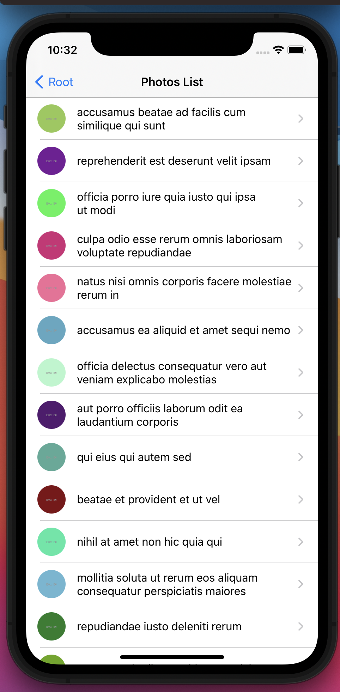
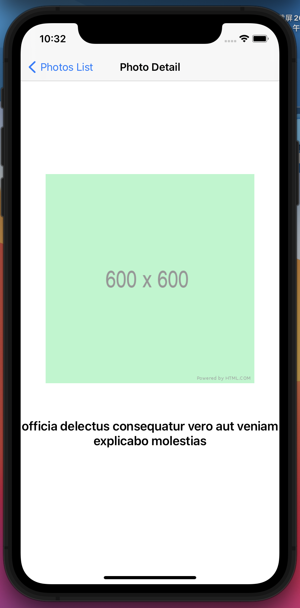

iOS `Photos` App
============================================

## Code Interview Process 

Please follow the task requirements, the component style should be matched the screenshot.

You have one day to do it.

- Create a new branch based on master instead of fork.
- [Create the PR](../../pulls) when you finished.
- Please communicate in English. Do not use Chinese in your Code, especially code and commits' comments.

If you have any questions, please feel free to [raise the issue](../../issues) in the repo. We're glad to help you.

Please let me know when your PR's ready for review.

## Notice:
Your code will be reviewed and scored by the other developers of the team you will join.

Your code will have higher score if:

1. You split the task into smaller tasks, complete them one by one, and commit them in different git commits with proper commit messages 
1. The code is clean and easy to read and understand
2. The variable and function names are considered carefully
3. Small and meaningful functions for complex logic
4. No typo and has good code format
5. Meaningful, carefully organized test cases covered most of the important functionality
6. Provide proper/valuable comments, but only when it's necessary (in code and/or in github PR). Try improving the code to avoid un-necessary comments. 

## Task

Implement the `Photos List` page and `Photo Detail` page of the `Photos` app.

1. `swift` is our first choice, but you can use `Objective-C` if you want.
2. You can use 3rd party libraries if you need.
3. provide proper comments in code (and only when it's necessary) 
4. show your best practise
5. use github pull request to submit your code

You can change any code in codebase to make it better.

## Requirement:




1. Implement the `Photos List` page and `Photo Detail` page in the MVC design model.
2. Implement the unit tests for your models
3. Implement a simple automation test for this app

## Install
Firstly, you should install the project in the root directory
```
pod install
```
